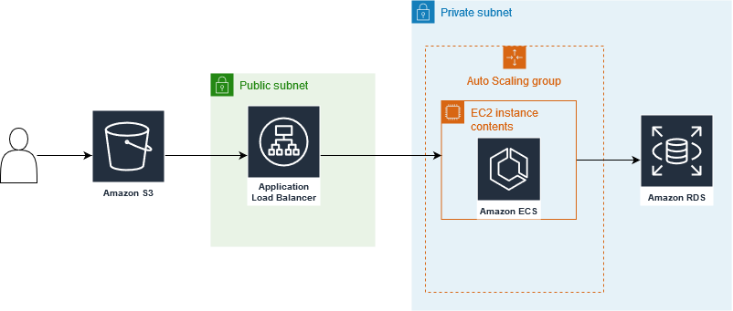

# RAMPUP 2 - Pizzas

## How is this made

### The app

* __Frontend:__ ReactJS app

* __Backend:__ Monolithic Spring Boot app with JPA

* __Database:__ MySQL

### Using the app

To see how the app works locally

#### Run the backend locally

```bash
docker run --name backend
    -p <port>:8080
    -e MYSQL_DB_PASSWORD=<db-password>
    -e MYSQL_DB_USER=<db-user>
    -e MYSQL_DB_PORT=<db-port>
    -e MYSQL_DB_HOST=<db-host>
    -e MYSQL_DB_DATABASE=<db-databasse>
    -d marteoma/pizzas-back
```

The db-params are the values that your database has.
The port is wheret the app will run in the host

#### Run the frontend locally

The frontend runs as a typical react app.
To run it locally:

1. Put your host on the .env file

```bash
REACT_APP_API_URL=<your-host>
```

2. Install modules

```bash
npm install
```

3. Run

```bash
npm start
```

Additional you can run tests by running

```bash
npm test
```

## The Cloud

The cloud infrastructure is based on ECS with EC2 instances

There is also an RDS with a the MySQL database and a S3 bucket working as hosting for the frontend.

### Build instrastructure

The cloud arquitecture is designed on AWS and implemented in terraform.
To create the resources on an AWS first, put your AWS credentials. There are two ways:

* With aws-cli

```bash
aws configure
```

* Manully, set in ~/.aws/credentials

```bash
[default]
region=<region>
aws_access_key_id=<acces-key>
aws_secret_access_key=<secret-key>
```

After having set up the credentials file you can run the terraform steps to create the infrastructure.

1. ```terraform init```

2. ```terraform apply```

In the _variables.tf_ file there are some key variables to have in count.

The instance type the EC2 will have.
```H
variable "instance_type" {
  default     = "t2.micro"
  description = "AWS instance type"
}
```

The minimum count of EC2 that your cluster can have.
```H
variable "min_cluster_size" {
    description     = "Minimum size of the cluster"
    default         = "2"
}
```

The maximum count of EC2 that your cluster can have.
```H
variable "max_cluster_size" {
    description     = "Maximum size of the cluster"
    default         = "3"
}
```

The number of docker containers running with the app.
```H
variable "desired_tasks" {
    description     = "Desired number of tasks running"
    default         = "2"
}
```

These values should be changed depending on the level of availavility desired.

There are also som values that are hidden, like the password to use in the database. These variables are described in the _terraform.tfvars.example_. To make it work, create a file _terraform.tfvars_ and add all the values described in the example, and add them a value. Like this:

```H
rds_database_password = "<password>"
```

### Arquitecture



As we see in the image we we have the frontend in the S3 bucket, which is connected to an ALB that balance traffic to the differentes instances of the cluster. And the instances connect to an RDS.

The EC2 are in an ASG and the RDS and the EC2 are in a private subnet, so it's not possible to acces directly.

### CI/CD

The both pipelines, (front and back), are made with CircleCI.

#### Backend

* Package and test
* Build docker image
* Push docker image to Dockerhub
* Update ECS service

This pipeline needs the following environment variables to work.

* __AWS_ACCESS_KEY_ID__ Access key of the aws account

* __AWS_DEFAULT_REGION__ Region for aws

* __AWS_SECRET_ACCESS_KEY__ Secret key of the aws account

* __DOCKER_LOGIN__ Username of dockerhub

* __DOCKER_PASSWORD__ Token of dockerhub

* __MYSQL_DB_DATABASE__ The name of the database created on AWS

* __MYSQL_DB_HOST__ The address of the database created on AWS, is an output of terraform

* __MYSQL_DB_PASSWORD__ The password of the database created on AWS

* __MYSQL_DB_PORT__ The port of the database created on AWS

* __MYSQL_DB_USER__ The user of the database created on AWS

#### Frontend

* Install modules
* Test
* Build
* Upload to S3

This pipeline needs the following environment variables to work.

* __AWS_ACCESS_KEY_ID__ Access key of the aws account

* __AWS_DEFAULT_REGION__ Region for aws

* __AWS_SECRET_ACCESS_KEY__ Secret key of the aws account

* __BACKEND__ DNS of the ALB, is an output of terraform

* __BUCKET__ Name of the S3 bucket

